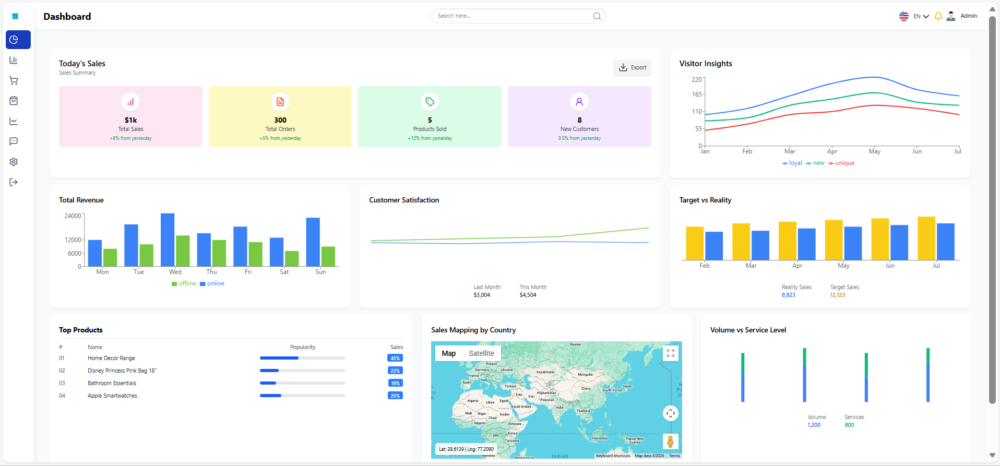
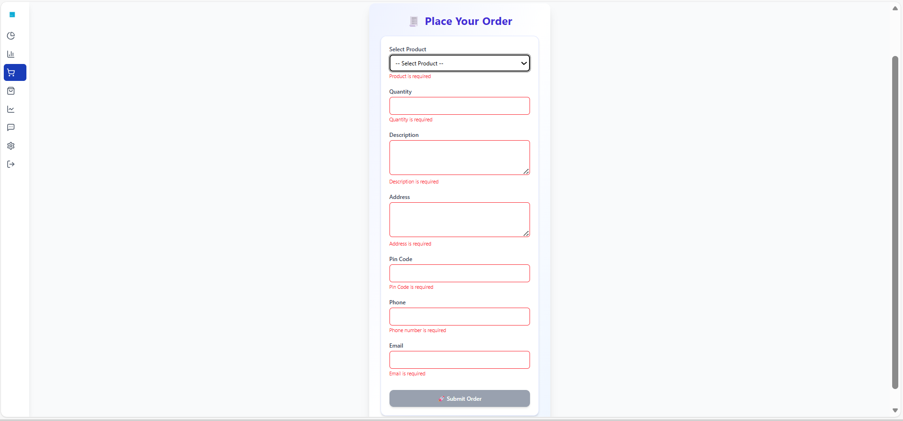
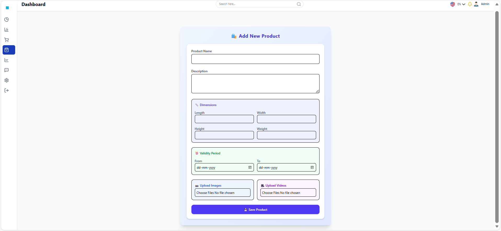

# 📊 Admin Dashboard & Order Management System

A full-stack dashboard application with admin analytics, product management, and order placement functionality.

This project includes:
- Interactive admin dashboard
- Add product form
- Place order form
- Responsive UI
- Backend API

---

## 🚀 Features

- Sales analytics dashboard  
- Visitor insights charts  
- Product management  
- Order placement system  
- Image & video upload  
- Validation forms  
- Responsive layout  

---

## 🖼 Screenshots

### Dashboard Overview

### Place Order Page

### Add Product Page

---

## 🛠 Tech Stack

**Frontend**
- HTML  
- CSS / Tailwind CSS  
- JavaScript  

**Backend**
- Node.js  
- Express.js  

---

## 📂 Project Structure

dashboard-project/
│
├── backend/ # Node.js server
│ ├── package.json
│ ├── package-lock.json
│ └── server.js
│
├── frontend/ # Frontend UI
│ ├── index.html
│ ├── css/
│ └── js/
│
├── screenshots/ # Project screenshots
│ ├── dashboard.png
│ ├── place_order.png
│ └── add_product.png
│
├── .gitignore
└── README.md